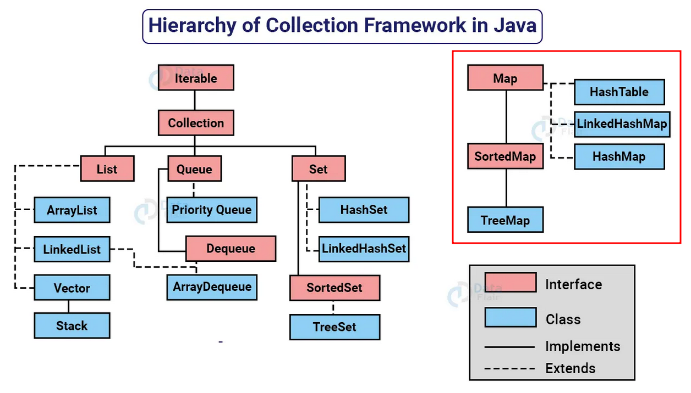

# MAP

 
<a href="https://data-flair.training/blogs/collection-framework-in-java/">Hierarchy of Collection Framework in Java </a>

- A interface `Map` é usada para mapear dados na forma de chaves e valores.
- O `Map` do Java é um objeto que mapeia chaves para valores.
- Um `Map` não pode conter chaves duplicadas: cada chave pode mapear no máximo um valor.
- A plataforma Java possui três implementações gerais de `Map`: `HashMap`, `TreeMap` e `LinkedHashMap`.
- As operações básicas do `Map` são: `put` (inserir ou atualizar), `get` (obter), `containsKey` (verificar se contém uma chave), `containsValue` (verificar se contém um valor), `size` (obter o tamanho) e `isEmpty` (verificar se está vazio).

> ##### *HashTable* é uma implementação antiga da interface Map no Java que é sincronizada e thread-safe, tornando-a adequada para uso em ambientes concorrentes. Ela não permite chaves ou valores nulos e os elementos não são mantidos em uma ordem específica.

> ##### *LinkedHashMap*, por outro lado, é uma implementação da interface Map que preserva a ordem de inserção dos elementos. Cada elemento possui referências ao próximo e ao anterior, formando uma lista encadeada. Isso permite que os elementos sejam iterados na ordem em que foram inseridos. Além disso, o LinkedHashMap também permite chaves ou valores nulos.

> ##### *HashMap* é uma implementação da interface Map que não mantém uma ordem específica dos elementos. Ele armazena os elementos internamente usando uma função de hash para melhorar a eficiência das operações de pesquisa e acesso. O HashMap também permite chaves ou valores nulos.

### Referências:

[1] "Collections in Java Tutorial." DigitalOcean Community. Disponível em: https://www.digitalocean.com/community/tutorials/collections-in-java-tutorial.

[2] "Java™ Platform, Standard Edition 17 API Specification - Class Map." Oracle. Disponível em: https://docs.oracle.com/en/java/javase/17/docs/api/java.base/java/util/Map.html.

## Fixando os Conhecimentos

Exercícios:

1. Operações Básicas com Map
2. Pesquisa em Map
3. Ordenação nas Map

---

## Pesquisa em Map

### Contagem de Palavras

Crie uma classe chamada "ContagemPalavras" que utilize um Map para armazenar as palavras e a quantidade de vezes que cada palavra aparece em um texto. Implemente os seguintes métodos:

- `adicionarPalavra(String palavra, Integer contagem)`: Adiciona uma palavra à contagem.
- `removerPalavra(String palavra)`: Remove uma palavra da contagem, se estiver presente.
- `exibirContagemPalavras()`: Exibe todas as palavras e suas respectivas contagens.
- `encontrarPalavraMaisFrequente()`: Encontra a palavra mais frequente no texto e retorna a palavra e sua contagem.

